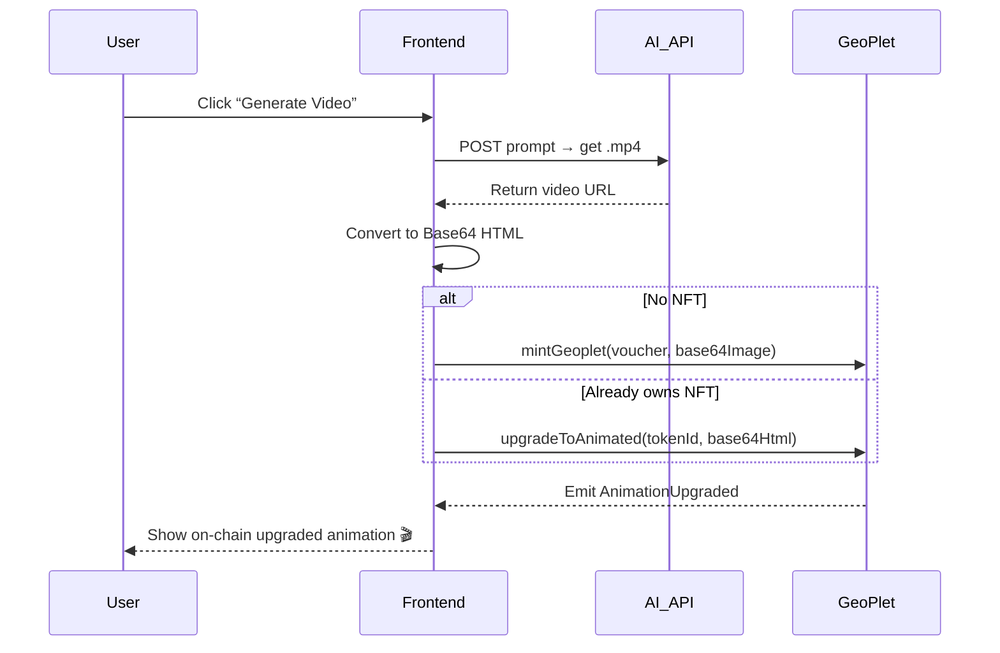

Here’s a **complete structured recap** of our discussion, written as a Markdown (`.md`) document — perfect for inclusion in your project repo or docs folder.
It includes all critical decisions, reasoning, and final architecture for the **GeoPlet “Video Upgrade System”**.

---

# 🧩 GeoPlet: On-Chain Video Upgrade System

## Overview

**GeoPlet** is a fully on-chain ERC-721 NFT collection that evolves from **static geometric art** to **animated on-chain video**.
The design combines AI-powered video generation (via **Sora** or **Grok**) with **SSTORE2 on-chain storage** and **EIP-712 mint validation**.

This document summarizes the entire design discussion and final implementation architecture.

---

## 🎨 Core Concept

> **Users mint a static GeoPlet NFT.**
> Later, they can **upgrade** that same token into an **animated version** — the upgraded animation is stored directly on-chain in Base64-encoded HTML (embedding the generated MP4 video).

This ensures:

* NFTs remain **fully on-chain** (metadata + animation).
* Visual upgrades are **user-driven**, **verifiable**, and **permanent**.
* The static and animated states coexist within a single ERC-721 contract.

---

## ⚙️ Technical Flow

### 1️⃣ Mint (Static)

* Users mint a GeoPlet NFT using a **signed voucher**.
* The contract stores Base64-encoded SVG (or static image) using **SSTORE2**.
* Metadata is dynamically built on-chain through `tokenURI()`.

### 2️⃣ Generate Video (Off-Chain)

* User clicks **“Generate Video”** in the frontend.
* The app calls **Sora** (OpenAI text-to-video) or **Grok Imagine** (xAI’s image-to-video) API:

  * Input: art prompt or reference image.
  * Output: `.mp4` clip (e.g., 10–15 seconds, 512×512).
* The app downloads and optimizes the video via `ffmpeg`.

### 3️⃣ Wrap Video in HTML

* The MP4 is Base64-encoded and embedded in an HTML document:

  ```html
  <html><body style="margin:0;overflow:hidden;background:#000;">
    <video autoplay loop muted playsinline width="100%" height="100%">
      <source src="data:video/mp4;base64,BASE64_OF_MP4" type="video/mp4">
    </video>
  </body></html>
  ```
* The HTML is then Base64-encoded again, producing a `base64HtmlAnimation` string ready for on-chain storage.

### 4️⃣ Upgrade On-Chain

* The frontend calls:

  ```ts
  contract.write.upgradeToAnimated([tokenId, base64HtmlAnimation]);
  ```
* The contract:

  * Stores the encoded HTML via **SSTORE2**.
  * Emits `AnimationUpgraded(tokenId, upgrader)`.

### 5️⃣ Dynamic Metadata

* `tokenURI()` dynamically checks if `animationPointers[tokenId]` exists:

  * If not → static metadata (fallback `.webp` URL).
  * If yes → adds `"animation_url": "data:text/html;base64,<html>"`.
* Marketplaces and on-chain renderers automatically reflect the upgrade.

---

## 🧱 Final Smart Contract

### Key Additions

| Change                                                           | Description                                        |
| ---------------------------------------------------------------- | -------------------------------------------------- |
| `mapping(uint256 => address) private animationPointers;`         | Stores SSTORE2 pointers for Base64 HTML animations |
| `event AnimationUpgraded(...)`                                   | Emitted when NFT upgraded                          |
| `upgradeToAnimated(uint256 tokenId, string calldata base64Html)` | Allows owner to attach animation                   |
| `tokenURI()` update                                              | Adds conditional `animation_url` logic             |
| `_buildMetadata()` update                                        | Accepts `animationUrl` argument                    |

---

## 🧠 Design Principles

| Goal                        | Implementation                                   |
| --------------------------- | ------------------------------------------------ |
| **Fully on-chain metadata** | Image + HTML stored via SSTORE2                  |
| **Dynamic rendering**       | `tokenURI()` builds JSON in memory               |
| **Decentralized upgrade**   | No admin toggle — user-triggered                 |
| **Gas-efficient storage**   | ~70% cheaper than SSTORE using SSTORE2           |
| **Backward compatible**     | Old NFTs still valid with fallback animation URL |
| **No re-minting**           | Same token, evolving art                         |

---

## 🧰 Tech Stack

| Layer              | Tool                                        | Purpose                       |
| ------------------ | ------------------------------------------- | ----------------------------- |
| Smart Contract     | Solidity + SSTORE2                          | On-chain data storage         |
| Frontend           | Next.js + Wagmi + GSAP                      | UI and Web3 interactions      |
| AI Video           | **Sora** (OpenAI) or **Grok Imagine** (xAI) | Text/image → video generation |
| Encoding           | FFmpeg / Node.js                            | Convert & Base64-encode video |
| Blockchain         | Base Mainnet                                | Deployment and verification   |
| Payment (optional) | x402 Aggregator                             | Pay-per-generation logic      |

---

## 🪄 Frontend Flow Summary



---

## 🎥 AI Model Notes

| Model                  | Output            | Format                       | Integration                 |
| ---------------------- | ----------------- | ---------------------------- | --------------------------- |
| **Sora (OpenAI)**      | Text → Video      | MP4 (H.264)                  | Via API call + download URL |
| **Grok Imagine (xAI)** | Image → Video     | MP4 (likely)                 | Via REST API from X / xAI   |
| Conversion             | MP4 → Base64 HTML | HTML wrapper stored on-chain | `data:text/html;base64,...` |

✅ Both models produce **MP4** as primary output.
If other formats are provided, convert to MP4 before encoding.

---

## 🧩 Marketplace Behavior

| Platform           | Thumbnail                            | Full View                               |
| ------------------ | ------------------------------------ | --------------------------------------- |
| OpenSea            | Uses `"image"`                       | Plays `"animation_url"` (HTML/Video)    |
| Zora               | Uses `"image"`                       | Interactive render of `"animation_url"` |
| Farcaster MiniApps | Renders `"animation_url"` OG preview |                                         |
| Base Apps          | Full HTML playback supported         |                                         |

Result: Static SVG is always shown in grid view, while animation plays in detail view.

---

## 💡 Optional Future Enhancements

| Feature                    | Description                                                                              |
| -------------------------- | ---------------------------------------------------------------------------------------- |
| 🔐 **Upgrade Voucher**     | Require EIP-712 signed backend authorization for `upgradeToAnimated` (x402 integration). |
| 💰 **Paid Upgrade**        | Require small ETH payment before storing animation pointer.                              |
| 🔄 **Regeneration System** | Allow overwriting existing animation pointer with a new version (paid regeneration).     |
| 🧾 **Metadata Versioning** | Add `animation_version` attribute to track NFT evolution.                                |
| 🧱 **Renderer Contract**   | Abstract rendering logic to a separate contract for modular upgrades.                    |

---

## 🧾 Example Metadata After Upgrade

```json
{
  "name": "GeoPlet #42",
  "description": "Fully on-chain geometric art evolved into animation.",
  "image": "data:image/svg+xml;base64,PHN2ZyB...",
  "animation_url": "data:text/html;base64,PGh0bWw+PHZpZGVv...",
  "attributes": [
    { "trait_type": "Collection", "value": "GeoPlet" },
    { "trait_type": "Creator", "value": "0xdas" },
    { "trait_type": "Status", "value": "Animated" }
  ],
  "external_url": "https://geoplet.geoart.studio"
}
```

---

## 🧩 Summary

| Layer            | Component                                     | Status |
| ---------------- | --------------------------------------------- | ------ |
| Smart Contract   | ✅ Upgraded with on-chain animation support    |        |
| Metadata         | ✅ Dynamic JSON with `animation_url`           |        |
| AI Integration   | ✅ Compatible with Sora / Grok MP4 output      |        |
| Frontend         | ✅ “Generate + Upgrade” UX ready for Next.js   |        |
| On-Chain Storage | ✅ SSTORE2 for image + HTML (24 KB limit each) |        |

---

## 🧭 Next Steps

1. **Deploy** updated `GeoPlet` contract to Base Mainnet or Base Sepolia.
2. **Integrate** Sora / Grok video generator backend route.
3. **Implement** “Generate & Upgrade” button in UI.
4. **Test** on marketplaces (Zora, OpenSea, Farcaster OG).
5. **Add Payment Gate (x402)** for monetized upgrades (optional).

---

**Author:** `0xdas`
**Project:** GeoArt.Studio → GeoPlet
**Version:** 1.2.0 (Video Upgrade Integration)
**Date:** 2025-11-06

---
